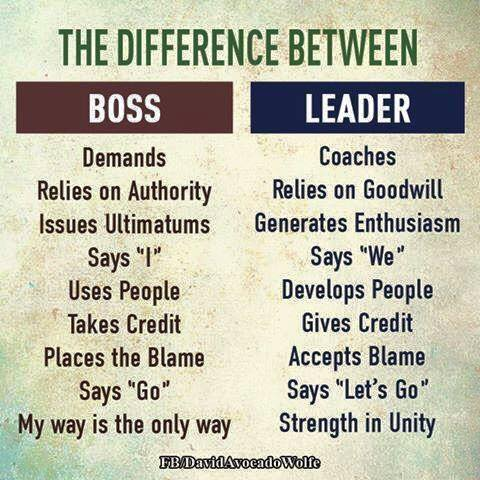

# About me

### What are some honest, unfiltered things about you?
- I love it when technology helps people interact in the world today, in ways we would describe as "Movie Magic" a decade ago
- **Tech junkie**
    - Owned the first iPhone
    - Google Glass Explorer # 1012
    - Magic Leap 1
- Photographer 
    - Travel with Nikon Z6
    - Also own a Nikon D850
- **Dog Lover :** Have 2 Shiba Inus
- Loves to grill / smoke meat
- I try not to re-invent when I can beg/borrow/steal

- mildly dyslexic 

### When are you available?

I enjoy mornings, and am at my best then. I prefer to work 8am PST to 5pm PST when possible.

### What drives you nuts?
> *Tell us about your pet peeves. These are things that put you in a bad mood.*
- **Lack of respect for time**
    - Time is the one thing we all have equal of, it doesn't respect wealth, knowledge, age, etc... 
    - Treat others as equals, treat their time as valuable as yours
- **things i view as lack of respect in general**
- Ignoring the customer, and their needs

### What are your quirks?
> *Tell us about those traits that are uniquely yours. How do you like to make decisions? How do you react to conflict?*
- Try and find everyone's core values. We all care about something, I would rather deal directly with what you care about and not beat around the bush.
		
### What are some things that people might misunderstand about you that you should clarify?
> *Think of some labels people may apply to you. Tell us why those are wrong.*
- Like above, I try and find everyone's core values. We all care about something, I would rather deal directly with what you care about and not beat around the bush. Tell me what you really want. If I'm asking weird questions, it's because I dont think we are talking about "the real issue "TM.

### I live in Seattle
> *How does living in Seattle affect things day to day?*
- **In the Winter:** The sun comes up at 8am (*7:50am*), and goes down at 4pm (*4:10pm*)
    - The winter can be very grey, and rainy. At some point in "the dark season" (*November through March*), if it snows or rains for 2 or 3 weeks straight (*if there is no sun, for > 21 days*), the first "sun day" that happens, I'll probably cancel a meeting or two and go get some Vitamin D between 10am and 2pm while it's bright out.
- **In the Summer:** The sun comes up at 5am (*5:11am*), and goes down around 9pm (*9:11pm*)

## About my colleagues

### What qualities do you particularly value in your colleagues?
> *Tell us what your ideal colleague would look like. These are the people you normally seek out at work.* 
- Extreme Ownership
- "Shippers" / Finishers"
- customer obsession

### What do you wish colleagues didn’t do?
> *Think of the people you avoid at work. What are their characteristics?*
- I avoid people who aren't finishers. People who Hand off tasks, don't drive things to completion
- It's important that you do not ignore the customer needs
- watch out for "the consensus trap", conflict is ok, the best idea should win

### How can people earn an extra gold star with you?
> *Think of the time when a colleague puts a smile on your face. What did they just do?*
- hard work, solved problems, helped customers, collaborate

## About my interactions

### How do you coach people to do their best work and develop their talents?
> *Tell us how you like to help others.*

	
### What’s the best way to communicate with you?
> *If you hate emails, tell us. If you prefer a quick zoom over a 15 min write up, tell us.*
I prefer quick communication that "gets the job done"
- a short email
- a short call
- a short meeting

I don't want a long any of these. 
- If it's going to be a long email, have a a short meeting. 
	
if you need coaching, don't hesitate to ask
  
### What’s the best way to convince you to do something?
> *Tell us how we can change your mind, once it’s made up.*

- Show me the data, show me you spent time on it
- show me you care about the customer, and this is best for them
	 
### How do you like to give feedback?
> *Tell us the modes, means, timing, approach, and level of detail you like to employ when giving feedback, and why that's so.*

### How do you like to get feedback?
> *Tell us the modes, means, timing, approach, and level of detail you like to see others employ when giving you feedback, and why that's so.*

