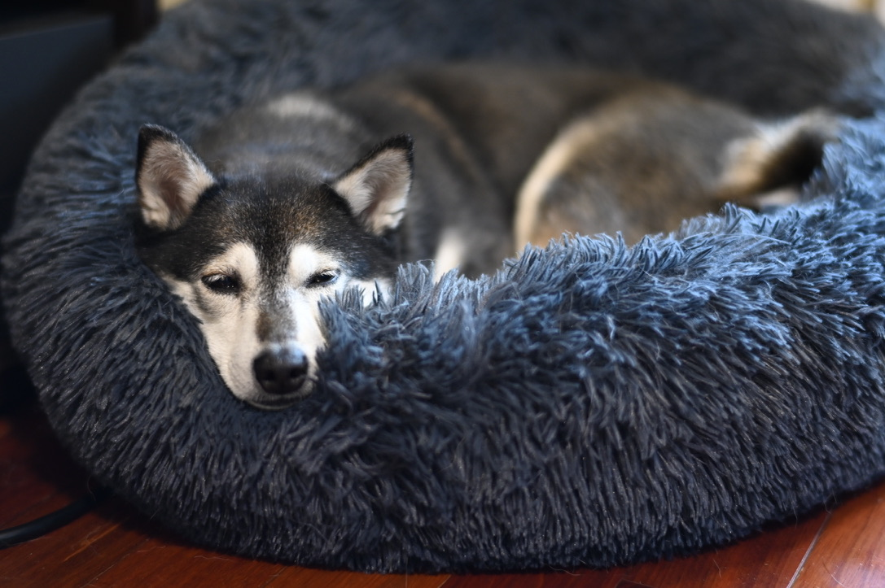

Thanks for stopping by!

I'm currently testing out this GitHub Personal Readme functionality. We'll have to see what the best use of it is in the long run, today I'm going to link to a few projects:
- https://github.tips/ is not under active work, but is a great place to store tips about GitHub
- https://github.com/GSD/BookClub 
- https://github.com/photography (and https://gallerytest.pauliver.com/ ) gets work when it's broken enough, or after I travel somewhere and need to upload photos

You might also be interested in
- https://pauliver.com/
- https://www.linkedin.com/in/pauliver/

